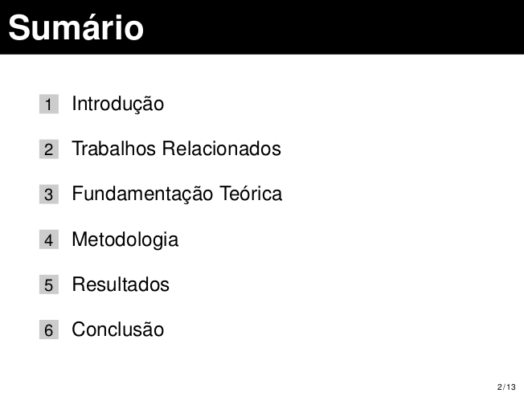

# LaTeX slides

[](https://travis-ci.org/cfgnunes/latex-slides)

Modelo de apresentação em slides utilizando [LaTeX](https://www.latex-project.org/).

Para um modelo de trabalho acadêmico, visite o projeto [latex-cefetmg](https://github.com/cfgnunes/latex-cefetmg/).



## Começando

### Instalar os pré-requisitos

Esta seção assume o Ubuntu 14.04 (também testado no Ubuntu 16.04 e no Ubuntu 18.04), mas o procedimento é semelhante para outras distribuições Linux.
Para instalar os pacotes necessários, execute os seguintes comandos no terminal:

```sh
sudo apt -y install make
sudo apt -y install latexmk
sudo apt -y install texlive
sudo apt -y install texlive-lang-portuguese
sudo apt -y install texlive-latex-extra
sudo apt -y install texlive-publishers
sudo apt -y install texlive-science
sudo apt -y install texlive-xetex
sudo apt -y install ghostscript

```

### Compilar documento

Para compilar o projeto e gerar o documento no formato PDF, execute o seguinte comando no terminal:

```sh
make
```

### Gerar uma versão compacta do documento

Para gerar uma versão mais compacta do documento final no formato PDF, execute o seguinte comando no terminal após compilar o documento:

```sh
make compress
```

## Contribuindo

Se você encontrar um problema ou quiser melhorar o código, ou até mesmo melhorar o conteúdo, você pode:

* [Abrir um problema](https://github.com/cfgnunes/latex-slides/issues/new) descrevendo o erro ou a ideia de uma funcionalidade nova;
* Criar um fork do projeto, realizar mudanças, e submeter um pull request.

## Autores

* Cristiano Nunes - *Desenvolvedor*
