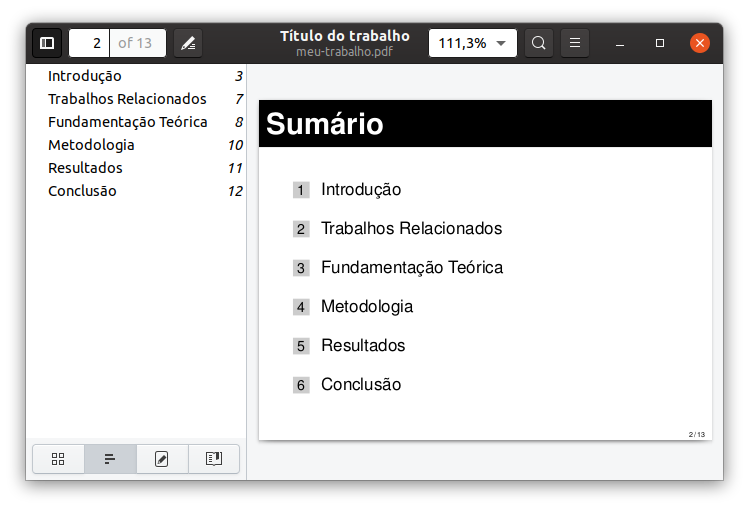

# LaTeX slides [](https://github.com/cfgnunes/latex-slides/actions)

Modelo de apresentação em slides utilizando [LaTeX](https://www.latex-project.org/).

Para um modelo de trabalho acadêmico, visite o projeto [latex-cefetmg](https://github.com/cfgnunes/latex-cefetmg/).



## Começando

### Pré-requisitos

Esta seção assume o Ubuntu 16.04 (também testado no Ubuntu 20.04), mas o procedimento é semelhante para outras distribuições Linux.
Para poder compilar o documento, basta instalar os seguintes pacotes no terminal:

```sh
sudo apt -y install make
sudo apt -y install latexmk
sudo apt -y install texlive
sudo apt -y install texlive-lang-portuguese
sudo apt -y install texlive-latex-extra
sudo apt -y install texlive-publishers
sudo apt -y install texlive-science
sudo apt -y install texlive-xetex
```

### Compilar documento

Para compilar o projeto e gerar o documento no formato PDF, execute o seguinte comando no terminal:

```sh
make
```

## Contribuindo

Se você encontrar um problema ou quiser melhorar o código, ou até mesmo melhorar o conteúdo, você pode:

- [Abrir um problema](https://github.com/cfgnunes/latex-slides/issues/new) descrevendo o erro ou a ideia de uma funcionalidade nova;
- Criar um fork do projeto, realizar mudanças, e submeter um pull request.

## Autores

- Cristiano Nunes
